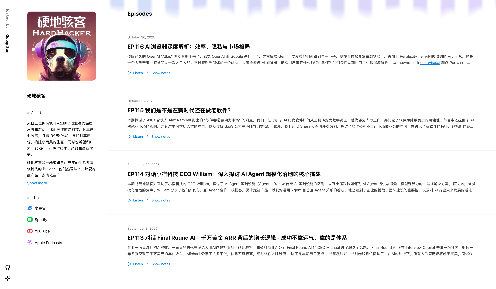

<div align="center">
  
  <h1>Podify</h1>

  [English](/README.md) | 简体中文

  <p>Podify 是一个使用 TanStack Start 构建的精美播客模板</p>

  
  
  
  
  
  
 

  
</div>

## ✨ 特性

- [x] 🌓 支持深色/浅色主题
- [x] ✨ 简约优雅的 UI 设计
- [x] 📱 响应式设计，适配所有设备
- [x] 🌐 多语言支持（中文/英文）
- [x] 🎨 多主题色彩支持
- [x] 🍼 RSS 数据自动解析
- [x] 🚀 cmdk 快速操作
- [ ] ...

## 🎬 展示

- https://shutiao.life

> 欢迎将您的网站添加到列表中 https://github.com/sun0225SUN/podify/issues/1

## 🔨 技术栈

- ⚡ 框架 - [TanStack Start](https://tanstack.com/start)
- 🧩 语言 - [TypeScript](https://www.typescriptlang.org)
- 🛣️ 路由 - [TanStack Router](https://tanstack.com/router)
- ⚙️ 构建工具 - [Vite](https://vitejs.dev)
- 🌬️ 样式 - [Tailwind CSS](https://tailwindcss.com)
- 🎛️ UI 组件库 - [Radix UI](https://www.radix-ui.com)
- 🐻 状态管理 - [TanStack Store](https://tanstack.com/store)
- 🌐 多语言 - [i18next](https://www.i18next.com)
- ✅ 模式验证 - [Zod](https://zod.dev)
- 🧹 格式化与代码检查 - [Biome](https://biomejs.dev)
- 🪝 Git 钩子 - [Lefthook](https://lefthook.dev)
- 📊 流量分析 - [Umami](https://umami.is)

## 🍭 社区

- [Telegram](https://t.me/guoqisun)

## 💡 灵感来源

- [Transmit](https://tailwindcss.com/plus/templates/transmit)

## 🚀 快速开始

[](https://app.netlify.com/start/deploy?repository=https://github.com/sun0225SUN/podify)

> [!warning]
> 请确保在运行项目之前正确配置所有必要的环境变量。

```bash
# 必需：播客的 RSS 订阅地址
VITE_PODCAST_RSS="https://example.com/podcast.rss"

# 可选：Umami 分析
VITE_UMAMI_SCRIPT="https://analytics.example.com/script.js"
VITE_UMAMI_WEBSITE_ID="your-website-id"
```

| 变量                    | 描述                | 默认值 | 必需 |
| :---------------------- | :------------------ | :----- | :--- |
| `VITE_PODCAST_RSS`      | 播客的 RSS 订阅地址 | 无     | 是   |
| `VITE_UMAMI_SCRIPT`     | Umami 分析脚本 URL  | 无     | 否   |
| `VITE_UMAMI_WEBSITE_ID` | Umami 分析网站 ID   | 无     | 否   |


## 💻 本地开发

1. 克隆仓库

```bash
git clone https://github.com/sun0225SUN/podify.git

cd podify
```

2. 在根目录创建 `.env` 文件，并按照 [🚀 快速开始](#-快速开始) 部分的说明配置环境变量。

3. 安装依赖

```bash
bun install
```

4. 启动开发服务器

```bash
bun run dev
```

打开：`http://localhost:3000` 查看您的应用程序。

## 📝 许可证

本项目采用 [MIT](LICENSE) 许可证。

## 🤝 贡献

欢迎贡献！随时可以提交 issue 和 pull request。

## 💖 赞助

如果您觉得这个项目有帮助，请在 GitHub 上给它一个 ⭐️！

<table>
	<tbody>
		<tr>
      <td align="center">
         
      </td>
      <td align="center">
        
      </td>
		</tr>
	<tbody>
</table>

## 📊 仓库状态


## ⭐ Star 历史

[](https://github.com/sun0225SUN/podify)